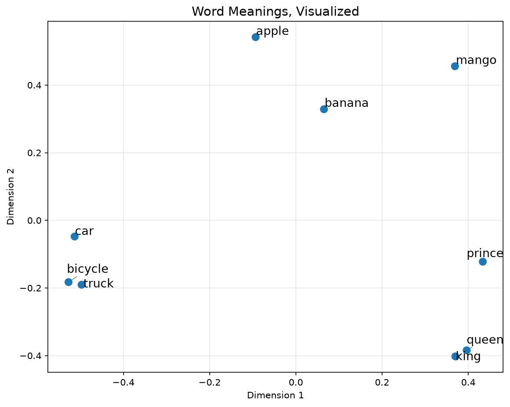

# Word Meanings, Visualized

I kept reading about "embeddings" everywhere and nodding along without actually
understanding what they were. So instead of reading another article, I decided
to build something small and just look at it with my own eyes.

## What this does

It takes a handful of words, turns each one into a set of numbers using a
pretrained language model, and then plots them on a simple graph. Words that
mean similar things end up sitting close together on the graph, without me
telling the model anything about their meaning.

## The result

Notice how fruits, vehicles, and royalty each landed in their own little
group. The model was never told "these are fruits" or "these are vehicles."
It figured that out purely from patterns in how these words are used in
language.

## How it works, in plain terms

**Step 1: Turning words into numbers (the embedding)**

Each word gets converted into a list of 384 numbers using a pretrained model
called `all-MiniLM-L6-v2`. This list of numbers is called an embedding. Think
of it as the model's way of describing what a word means, but instead of
using other words to describe it, it uses numbers. Words that are used in
similar ways in language end up with similar numbers.

Why 384 numbers specifically and not some other amount? That is just a
design choice made by whoever built this particular model. Some models use
384, some use 768, some use over a thousand. More numbers can capture more
detail about meaning, but also take more memory and computing power. 384 is
a common middle ground for a small, fast model like this one, which is why
I picked it for a simple project like this.

**Step 2: Making 384 numbers something we can actually see (PCA)**

Here is the problem. A graph only has two directions we can plot on, left to
right and up to down. But each word has 384 numbers attached to it, and there
is no normal graph with 384 directions. So we need a way to squeeze 384
numbers down into just 2, while losing as little important information as
possible.

The technique that does this is called PCA, short for Principal Component
Analysis. You do not need to understand the math behind it to use it. All
you need to know is that it looks at all your data, figures out the two
directions where the data varies the most, and gives you a simplified 2
number version of each word based on those directions. It is essentially a
smart way of compressing information down to the parts that matter most for
telling things apart.

**Step 3: Plotting it**

Those 2 numbers become the x and y position of each word on the graph. Words
that ended up with similar numbers in step 1 land close together here, which
is why you can visually see fruits, vehicles, and royalty forming their own
little clusters.

## Running it yourself

You will need Python installed on your computer (version 3.9 or newer).
Check by running `python --version` in your terminal.

1. Download or clone this repository, then open the folder in your terminal
   or code editor.

2. Create a virtual environment. This keeps the packages this project needs
   separate from anything else on your computer, so nothing conflicts.

   `python -m venv venv`

3. Activate the virtual environment.
   - Windows: `venv\Scripts\activate`
   - Mac or Linux: `source venv/bin/activate`

4. Install the required packages. These are all listed in requirements.txt,
   so one command installs everything needed.
   `pip install -r requirements.txt`

5. Run the script.
    `python generate_embeddings.py`

The first run will download the pretrained model, which is small, around
80MB, and only happens once. After that, a window will pop up showing the
plot, and it will also save a copy as `embedding_plot.png` in the folder.

Feel free to change the `words` list in the script to whatever words you
want and see what clusters form.

## What I actually learned building this

Turns out embeddings are not magic, they are just numbers arranged so that
similar meanings end up close together mathematically. This is the same
basic idea behind how search engines find relevant results, how
recommendation systems work, and how tools like RAG chatbots retrieve
relevant information. Seeing it as dots on a graph made it click in a way
that reading about it never did.